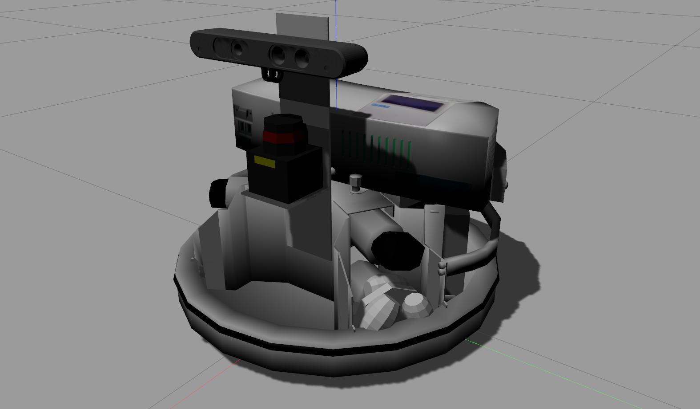

# Robotino-Simulation

This repository contains the ROS source code for simulating the Festo Robotino robot (RTO). 



## ROS 1 Packages for Robotino-Simulation
|master|Melodic + Ubuntu Bionic|Noetic + Ubuntu Focal|
|:---:|:---:|:---:|
|[](https://travis-ci.com/dietriro/rto-simulation)|[](https://travis-ci.com/dietriro/rto-simulation)|[](https://travis-ci.com/dietriro/rto-simulation)|


## Overview

In the following, all packages within this repository are briefly explained.

### Core Repository

<dl>
  <dt><strong><a href="https://github.com/dietriro/rto-core/tree/noetic-devel/rto_bringup_sim">rto_bringup_sim</a></strong></dt>
  <dd> Contains config, script and launch files for starting the robot in a simulated world. </dd>
  <dt><strong><a href="https://github.com/dietriro/rto-core/tree/noetic-devel/rto_simulation">rto_simulation</a></strong></dt>
  <dd> The meta-package of this repository. </dd>
  <dt><strong><a href="https://github.com/dietriro/rto-core/tree/noetic-devel/rto_worlds">rto_worlds</a></strong></dt>
  <dd> Contains all world models etc. for bringing up a simulation environment (e.g. gazebo). </dd>
</dl>

In order to use these packages and with that use the robot in a simulated environment you need to have the core packages installed (see below).

### Dependencies

<dl>
  <dt><strong><a href="https://github.com/dietriro/rto-core">rto-core</a></strong></dt>
  <dd> This repository contains everything needed to start-up the RTO in a simulated environment or the real-world, including localization and navigation. </dd>
</dl>

## Installation

In order to use this package with the [rto-core](https://github.com/dietriro/rto-core) package, you need to first follow the installation instructions from the core repository. Afterwards you just have to clone this repository into your catkin workspace, install all dependencies and build it.

```bash
cd ~/catkin_ws/src
git clone https://github.com/dietriro/rto-simulation.git
cd ~/catkin_ws
rosdep install -y --from-paths src --ignore-src --rosdistro noetic --os=ubuntu:focal
catkin build
```

Afterwards you can use the robot in a simulated environment as described in the next section.

## Usage

Similarly to the real-world launch structure, you have to execute the following command in a terminal in order to start a simulation environment (in this case gazebo) with a robot:

    roslaunch rto_bringup_sim robot.launch

In order to run this successfully, you first need to specify the robot you'd like to use (e.g. rto-1) as well as the world you would like the robot to use (e.g. sim_simple) as environment variables, if you haven't added them to your `.bashrc` yet.

    export ROBOT=rto-1
    export ROBOT_ENV=sample

The `robot.launch` file then starts up all necessary nodes for simulating the environment together with the specified robot in gazebo. 

This launch file, however, does not start-up any localization or navigation algorithm. If you would like to map the environment from scratch without a previous map using **SLAM** you can run the following command after starting up the robot as described in the previous part:

    roslaunch rto_navigation slam.launch

You will need the same environment variables (ROBOT, ROBOT_ENV) for this launch file as you did for the previous one. This file then launches a slam algorithm from the [slam-toolbox](https://github.com/SteveMacenski/slam_toolbox). You can of course also use any other slam framework but the one from Steve Macenski is quite comprehensive and covers even long-term features as well as a continuation feature where you start from a previously built map.

If you already have a map and want the robot to **localize and navigate** in it then you need to run the following:

    roslaunch rto_navigation navigation.launch

Again, the same environment variables as before (ROBOT, ROBOT_ENV) are needed. 

Regardless of the localization/navigation launched, you can always run an **rviz** instance with pre-designed configuration file

    roslaunch rto_bringup rviz.launch

This configuration includes visualizations for the most important topics.